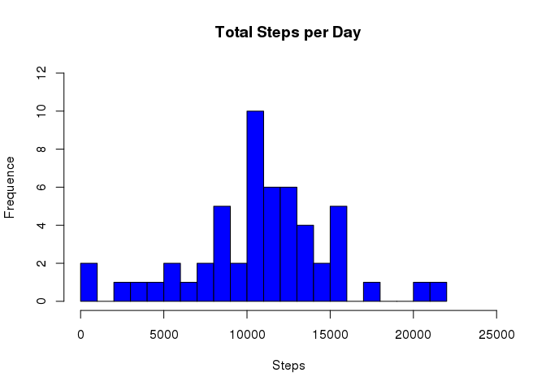
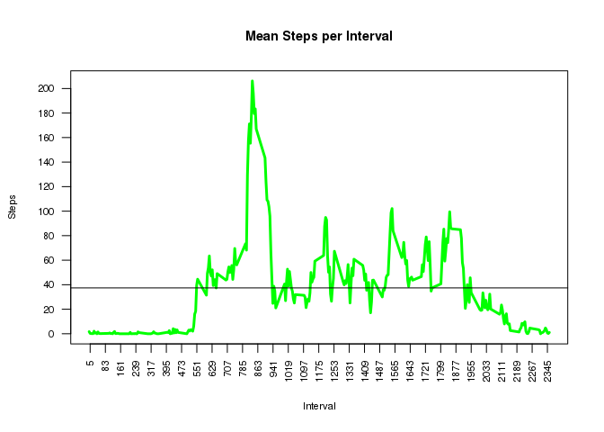
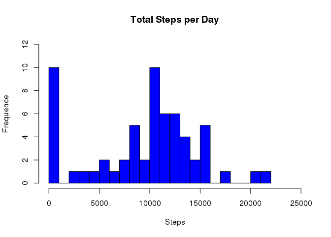
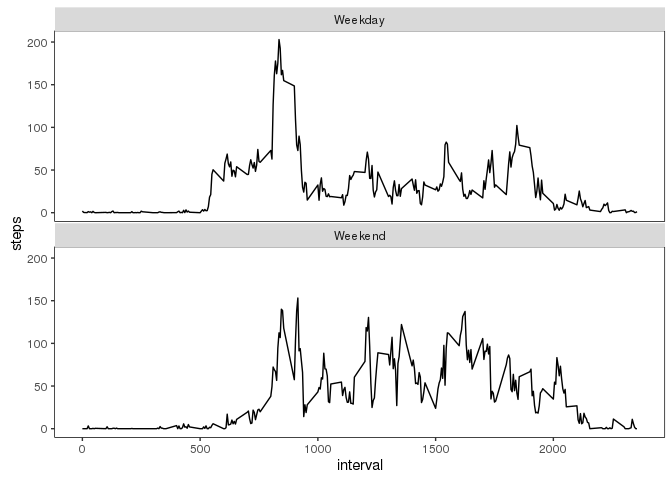

# Reproducible Research: Peer Assessment 1


## Loading and preprocessing the data


```r
if(!file.exists('activity.csv')) {
download.file("https://d396qusza40orc.cloudfront.net/repdata%2Fdata%2Factivity.zip", 'repdata-data-activity.zip', method='curl')
unzip('repdata-data-activity.zip')
}
data <- read.csv('activity.csv')
data$date <- as.Date(data$date, "%Y-%m-%d")
```

## What is mean total number of steps taken per day?

For the analysis of this topic, it was considered appropriate to submit a histogram plot type of steps taken per day.


```r
library(dplyr)
g1 <- group_by(data, date)
s1 <- summarise(g1, steps=sum(steps))
hist(s1$steps, breaks=20, freq=T, col="blue", main="Total Steps per Day", ylab="Frequence", xlab="Steps", xlim=c(0,25000), ylim=c(0,12))
```

 

Analyzing the data, there has been the following mean and median, excluding the missing values:


```r
mean(s1$steps, na.rm=TRUE)
```

```
## [1] 10766.19
```

```r
median(s1$steps, na.rm=TRUE)
```

```
## [1] 10765
```

## What is the average daily activity pattern?

The plot below shows an average of steps taken in a 5-minute interval for every day in which data were collected.

Hereby it is possible to identify a plot pattern of activity.


```r
g <- group_by(data, interval)
s <- summarise(g, steps=mean(steps, na.rm = TRUE))
plot.default(s, type="l", yaxt='n', xaxt='n',  col="green", lwd=3, xlab="", ylab="", xlim=c(min(s$interval, na.rm=TRUE), max(s$interval, na.rm=TRUE)), ylim=c(min(s$steps, na.rm=TRUE), max(s$steps, na.rm=TRUE)))
title(ylab="Steps", cex.lab=0.7, line=3)
title(xlab="Interval",main = "Mean Steps per Interval", cex.main=0.9, cex.lab=0.7)
axis(2, at=seq(0,max(s$steps, na.rm=TRUE), by=as.integer((max(s$steps, na.rm=TRUE)-0)/10)), tick = 5, cex.axis=0.7, las=1)
axis(1, at=seq(5,max(s$interval, na.rm=TRUE), by=as.integer((max(s$interval, na.rm=TRUE)-5)/30)), tick=5, cex.axis=0.7, las=2)
abline(h=mean(s$steps))
```

 

It appears that the highest average is in the interval below:


```r
s$interval[which.max(s$steps)]
```

```
## [1] 835
```

## Imputing missing values

The data have a number of days/intervals where there are missing values (coded as NA).


```r
tfna <- is.na(data$steps)
sum(tfna==T)
```

```
## [1] 2304
```

The presence of missing values may introduce bias into some calculations or summaries of the data.

So to avoid missing values, it was decided to replace them with the average of the previous value and the subsequent value, using a function.


```r
data2 <- data
f <- function(data2) {
    for(i in 1:nrow(data2)) {
        if (is.na(data2$steps[i])) {
            if(i==1) { data2$steps[i] <- 0 }
            else {
                if(i==nrow(data2)) { data2$steps[i] <- 0 }
                else {
                    if(is.na(data2$steps[i+1])) { ifelse(data2$steps[i-1] > 0, as.integer(data2$steps[i] <- data2$steps[i-1]/2), data2$steps[i] <- 0) }
                    else { data2$steps[i] <- as.integer((data2$steps[i-1] + data2$steps[i+1])/2) }
                }
            }
        }
    }
    data2
}
```


```r
data2 <- f(data2)
```

Since the missing data were replaced was built a new plot.


```r
g2 <- group_by(data2, date)
s2 <- summarise(g2, steps=sum(steps))
hist(s2$steps, breaks=20, freq=T, col="blue", main="Total Steps per Day", ylab="Frequence", xlab="Steps", xlim=c(0,25000), ylim=c(0,12))
```

 

And a new mean and median was calculate.


```r
median(s2$steps)
```

```
## [1] 10395
```

```r
mean(s2$steps)
```

```
## [1] 9354.23
```

Imputing missing data cause a reduction in the mean value.  
From:

```r
mean(s1$steps, na.rm = T)
```

```
## [1] 10766.19
```
To:

```r
mean(s2$steps)
```

```
## [1] 9354.23
```

And also a reduction in the median value.  
From:

```r
median(s1$steps, na.rm = T)
```

```
## [1] 10765
```
To:

```r
median(s2$steps)
```

```
## [1] 10395
```

This happend because many of NAs were filled by zero, according to the adopted strategy.

## Are there differences in activity patterns between weekdays and weekends?

To reply to this topic a new variable was created to identify if the observation belonged to a weekend or a weekday .


```r
Sys.setlocale("LC_TIME", "C")
```

```
## [1] "C"
```

```r
data2 <- mutate(data2, week = as.factor(ifelse(weekdays(date, abbreviate = TRUE) == "Sat" | weekdays(date, abbreviate = TRUE) == "Sun", "Weekend", "Weekday")))
```

A plot was constructed trying to demonstrate the activity difference between a weekday and a weekend .


```r
library(ggplot2)
g3 <- group_by(data2, interval, week)
s3 <- summarise(g3, steps=mean(steps))
ggplot(s3, aes(interval,steps,group=week))  + geom_line() + facet_wrap(~week, ncol=1, nrow=2) + theme(panel.margin = unit(0.1, "lines"), panel.grid.major = element_blank(), panel.grid.minor = element_blank(), panel.background = element_blank(), panel.border = element_rect(colour = "black", fill=NA, size=0.25))
```

 

Based on the plot above it can conclude that there is a difference of activity.
